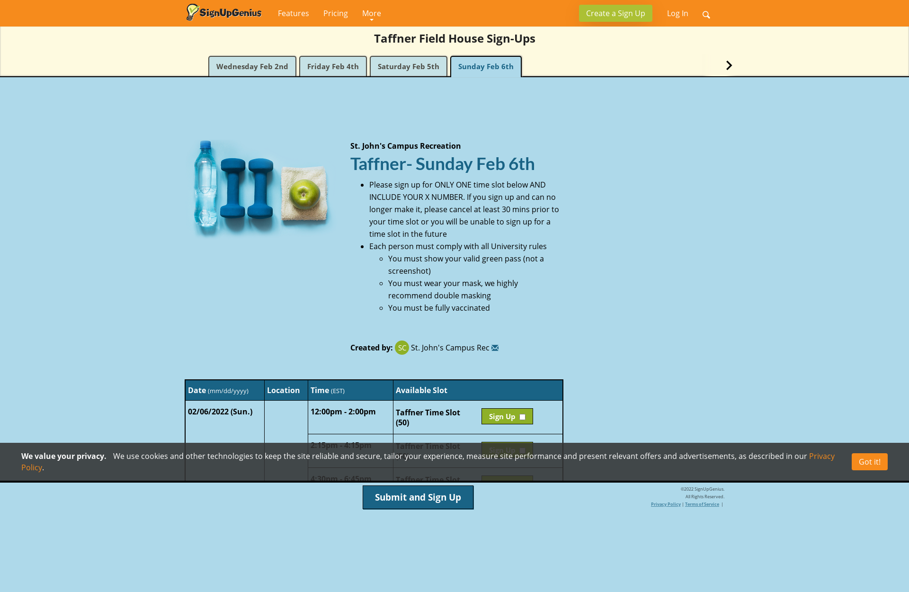
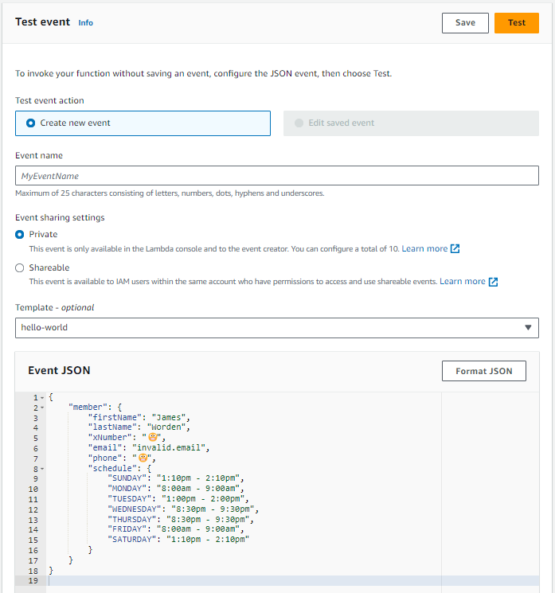
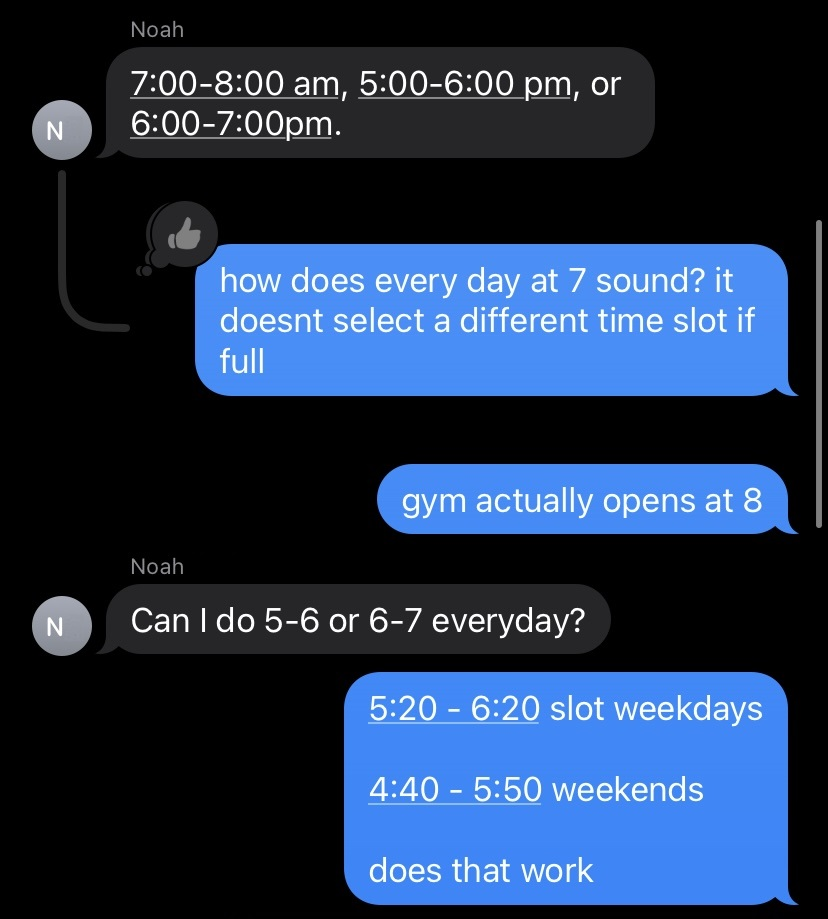
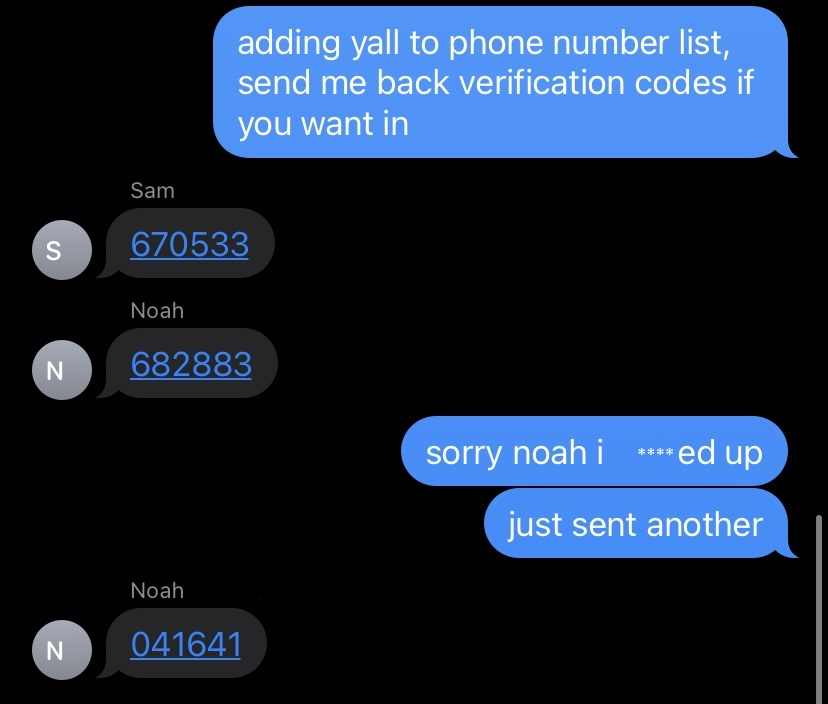
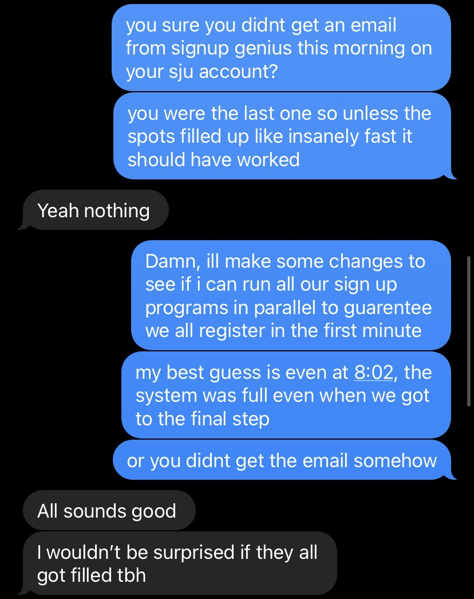
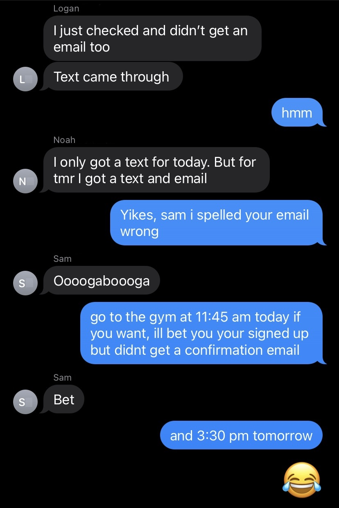
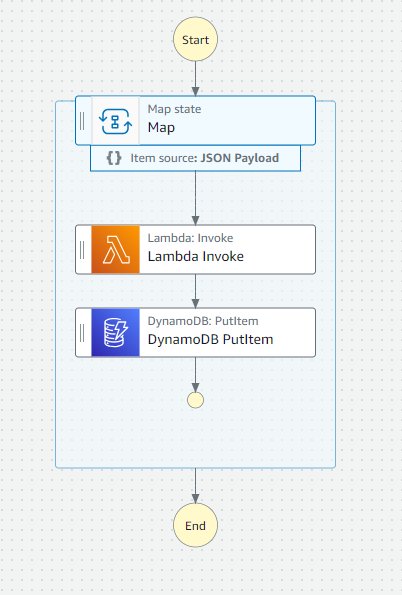

On January 18th, 2022, St. John's University Campus Recreation posted an [announcement on their Instagram account](https://www.instagram.com/p/CY4j9KcuTww/):

> Upon our reopening on Thursday, 1/20 at 8AM, the fitness center and Taffner Field House will be operating at a limited capacity of 30 occupants.
>
> Students and faculty must register in advance for their visit by heading to [linktr.ee.com/stjohnscrec](https://linktr.ee/Stjohnscrec) and signing up via the appropriate link
>
> Sign-ups will be available in one hour increments and will open each morning for the following day.
>
> Any questions, contact us by phone, email, or our socials.
>
> We appreciate your continued effort to keep our campus safe!

As a student who frequented the gym, this policy made it difficult to find a time slot that fit in my busy schedule; it was a race to reserve spots when registration opened every morning. This was a problem because I had to remember to sign up each morning, preventing me from sleeping in on days when classes began in the afternoon. For the time being, however, there was no other option.

## How students signed up

In the biography section of the St. John's University Campus Recreation Instagram account lies the URL to their [LinkTree](https://linktr.ee/) (an organization's online directory).


<sub>LinkTree Page</sub>

Clicking on the `Fitness Center Sign-Up` link directed students to [signupgenius.com](https://www.signupgenius.com/) where they selected the date and time they wished to register for.


<sub>Schedule Page</sub>

The date was selected by clicking the appropriate tab at the top of the screen and the selected time was adjacent to whichever `Sign Up` button the student decided to click. Doing so took them to the final page of the process.


<sub>Credientials Page</sub>

Once this form was completed, an email was sent to the student, confirming their registration.

## I had an epiphany

Aside from being enrolled at St. John's University during this spring semester of 2022, I was also working part time for [Trimble Maps](https://maps.trimble.com/) as a Software Development Engineer in Test Intern. My team utilized [Cypress](https://www.cypress.io/) and [Playwright](https://playwright.dev/), two technologies allowing us to simulate user behavior on websites for automated end-to-end testing. It occurred to me that I could automate the process of signing up for the gym each morning using a similar technology, [Puppeteer](https://pptr.dev/).

Puppeteer seemed to me a better choice for programmatic interaction with websites because Cypress and Playwright were designed specifically for testing. There was also [Selenium](https://www.selenium.dev/), but I found it to be older and less popular. On January 21st, 2022, I forked [Jordan Hansen's `Puppeteer on Lambda` GitHub repository](https://github.com/aarmora/puppeteer-on-lambda) with the intention of utilizing Puppeteer's form-filling API's on AWS Lambda. I knew that this program needed to run every day at 8:00 AM when registration began and guessed correctly that AWS had a feature for triggering functions at certain times of the day. This repository also used NodeJS and TypeScript, which I was very familiar with.

## How my program worked

Before I describe the code, it's important to understand a couple of things:

-   This blog post was written in September of 2023 and this repository was created in January of 2022. It's difficult for me to recall _exactly_ what my thoughts and order of operations were. I will do my best to interpret why and when I did what.
-   Sensitive information in the codebase has been replaced with 😬.
-   [All of the code can be found on GitHub](https://github.com/jamesworden/gym-registration-automation)

---

AWS Lambda Functions with a NodeJS runtime start by executing a `handler` function at the root `index.js` file. To run my code locally, I used a NodeJS script that would trigger the `handler` function just like AWS Lambda would. It was imperative to think about how my local code would eventually be deployed and ran remotely.

```javascript
const member = require('./member.json');
const { handler } = require('./dist/index');

async function runLocal() {
	console.log(member);
	const response = await handler(member);

	console.log(response.statusCode);
}

runLocal();
```

<sub>run-local.js</sub>

Notice that `handler` receives one input parameter, `member`. This object contains a student's credentials and their desired schedule at the gym. I stored this test data inside of `member.json`.

```JSON
{
  "member": {
    "firstName": "James",
    "lastName": "Worden",
    "xNumber": "😬",
    "email": "invalid.email",
    "phone": "😬",
    "schedule": {
      "SUNDAY": "1:10pm - 2:10pm",
      "MONDAY": "8:00am - 9:00am",
      "TUESDAY": "1:00pm - 2:00pm",
      "WEDNESDAY": "8:30pm - 9:30pm",
      "THURSDAY": "8:30pm - 9:30pm",
      "FRIDAY": "8:00am - 9:00am",
      "SATURDAY": "1:10pm - 2:10pm"
    }
  }
}
```

<sub>member.json</sub>

Inside of the `handler` function is the line of code that signs the member up:

```typescript
const { message, timeslot } = await signUpMember(member, isTestRun);
```

<sub>index.ts</sub>

Here is the function `signUpMember` in its entirety. It's not the cleanest code, but it _did_ work.

```typescript
import {
	CredentialsPage,
	FirstTabSchedulePage,
	LinkTreePage,
	TomorrowTabSchedulePage,
} from './pages';
import { Member } from './member';
import { getNewBrowser } from './get-new-browser';
import { sendText } from './send-text';
import { takeScreenshot } from './take-screenshot';

export const signUpMember = async function (member: Member, isTestRun: boolean = true) {
	const browser = await getNewBrowser();
	const page = await browser.newPage();

	console.log(`Begin signup for ${member.firstName + ' ' + member.lastName}`); // CRITICAL
	const signUpType = isTestRun ? 'taffner' : 'fitness';
	member.email = isTestRun ? 'invalid.email' : member.email;

	const linkTreePage = new LinkTreePage(page, 'https://linktr.ee/Stjohnscrec');
	await linkTreePage.goto();
	await takeScreenshot(page, `linktree-crec-pre-${member.firstName}`);
	const urlsOnLinkTreePage = await linkTreePage.getAllUrls();
	const firstTabPageUrl = urlsOnLinkTreePage.find((url) => url.includes(signUpType));
	await takeScreenshot(page, `linktree-crec-post-${member.firstName}`);

	const firstTabPage = new FirstTabSchedulePage(page, firstTabPageUrl);
	await firstTabPage.goto();
	await takeScreenshot(page, `schedule-page-first-tab-pre-${member.firstName}`);
	await firstTabPage.clickCookieButtonIfExists();
	const tomorrowTabPageUrl = await firstTabPage.getTomorrowTabUrl();
	await takeScreenshot(page, `schedule-page-first-tab-post-${member.firstName}`);

	const tomorrowTabPage = new TomorrowTabSchedulePage(page, tomorrowTabPageUrl);
	await tomorrowTabPage.goto();
	await takeScreenshot(page, `schedule-page-last-tab-pre-${member.firstName}`);
	await tomorrowTabPage.clickCookieButtonIfExists();
	const pageTitle = await tomorrowTabPage.getTitle();

	let timeslot = '';
	let day = '';

	if (pageTitle.includes('Sun')) {
		timeslot = member.schedule.SUNDAY;
		day = 'Sunday';
	} else if (pageTitle.includes('Mon')) {
		timeslot = member.schedule.MONDAY;
		day = 'Monday';
	} else if (pageTitle.includes('Tue')) {
		timeslot = member.schedule.TUESDAY;
		day = 'Tuesday';
	} else if (pageTitle.includes('Wed')) {
		timeslot = member.schedule.WEDNESDAY;
		day = 'Wednesday';
	} else if (pageTitle.includes('Thu')) {
		timeslot = member.schedule.THURSDAY;
		day = 'Thursday';
	} else if (pageTitle.includes('Fri')) {
		timeslot = member.schedule.FRIDAY;
		day = 'Friday';
	} else if (pageTitle.includes('Sat')) {
		timeslot = member.schedule.SATURDAY;
		day = 'Saturday';
	} else {
		console.log(`No weekday found in title of signup form for ${pageTitle}`);
		return;
	} // Taffner test times.

	const isWeekend = day == 'Saturday' || day == 'Sunday';

	if (isTestRun && isWeekend) {
		timeslot = '12:00pm - 2:00pm'; // Weekends
	} else if (isTestRun) {
		timeslot = '12:20pm - 2:20pm'; // Weekdays
	}

	if (timeslot == '') {
		await browser.close();

		return {
			message: `${member.firstName} has not specified a timeslot for this ${day}`,
			timeslot: 'None',
		};
	} // Increase table visibility to check checkboxes

	await tomorrowTabPage.scrollToTable();
	await page.setViewport({
		width: 500,
		height: 600,
	});

	await tomorrowTabPage.selectCheckbox(timeslot);
	await takeScreenshot(page, `schedule-page-last-tab-post-${member.firstName}`);

	await tomorrowTabPage.clickSubmitButton();
	const credentialsPage = new CredentialsPage(page);
	await takeScreenshot(page, `credentials-page-pre-${member.firstName}`);
	await credentialsPage.clickCookieButtonIfExists();
	await credentialsPage.setXNumber(member.xNumber);
	await credentialsPage.setFirstName(member.firstName);
	await credentialsPage.setLastName(member.lastName);
	await credentialsPage.setEmail(member.email);
	await takeScreenshot(page, `credentials-page-post-${member.firstName}`); // await credentialsPage.clickSubmitButton();
	const message = `Hello ${member.firstName}, you are registered for this ${day} at: ${timeslot}.`;

	if (isTestRun) {
		await credentialsPage.assertInvalidEmailError();
		await browser.close();

		console.log('All tests pass.');
		console.log(message);

		return {
			message,
			timeslot,
		};
	}

	await browser.close();

	await sendText(member.phone, message);

	return {
		message,
		timeslot,
	};
};
```

<sub>sign-up-member.ts</sub>

I enveloped page specific interactions inside of classes, namely `LinkTreePage`, `FirstTabSchedulePage`, `TomorrowTabSchedulePage`, and `CredentialsPage`. Technically, `FirstTabSchedulePage` and `TomorrowTabSchedulePage` pertained to the same website URL, but they contained different functions that ought to be performed depending on which tab was selected. The tabs also rendered different HTML, so it was important that there were different classes to account for this. Here's the all of the code for the `CredentialsPage`. This demonstrates how I used Puppeteer to navigate through pages as if the program were human.

```typescript
import { Page } from 'puppeteer-core';

export class CredentialsPage {
	page: Page;

	constructor(page: Page) {
		this.page = page;
	}

	async clickCookieButtonIfExists() {
		const [cookieButton] = await this.page.$x("//button[contains(text(), 'Got it!')]");
		if (cookieButton) await cookieButton.click();
	}

	async setXNumber(xNumber: string) {
		await this.page.evaluate(() => {
			document.querySelector('input').setAttribute('id', 'xNumber');
		});

		await this.page.type('#xNumber', xNumber);
	}

	async setFirstName(firstName: string) {
		await this.page.type('#firstname', firstName);
	}

	async setLastName(lastName: string) {
		await this.page.type('#lastname', lastName);
	}

	async setEmail(email: string) {
		await this.page.type('#email', email);
	}

	async clickSubmitButton() {
		const [button] = await this.page.$x("//button[contains(text(), 'Sign Up Now')]");
		if (button) await button.click();
	}

	async assertInvalidEmailError() {
		let errorExists = await this.page.evaluate(() => {
			let el = document.querySelector('.feedback-error');
			return el ? true : false;
		});

		if (!errorExists) {
			throw new Error('There should be an error about the email');
		}
	}
}
```

<sub>credentials-page.ts</sub>

Using these classes, `signUpMember` completed each page while logging important information throughout the process. All was well with my program locally; it was time to deploy my code.

### The woes of remote code execution

To do so, I harnessed the power of Hansen's repository to first compile and compress my JavaScript.

```JSON
"zip": "tsc && 7z a -r function.zip ./dist/*  node_modules/"
```

<sub>'zip' NPM Script</sub>

Then, the resulting ZIP file would be uploaded to the S3 bucket, `gym-register`, that my lambda function, `puppeteer-on-lambda`, would know where to find and execute the program at.

```JSON
"deploy": "npm run zip && aws s3 cp function.zip s3://gym-register && aws lambda update-function-code --function-name puppeteer-on-lambda --s3-bucket gym-register --s3-key function.zip"
```

<sub>'deploy' NPM Script</sub>

Uploading the ZIP archive to S3 was a necessary step for me to use Puppeteer on AWS Lambda because [250 MB is the maximum unzipped file size for a ZIP deployment package on S3, while 50MB is the maximum file size for direct upload](https://docs.aws.amazon.com/lambda/latest/dg/gettingstarted-limits.html#function-configuration-deployment-and-execution). If I recall correctly, the deploy NPM script initially [failed repeatedly](https://github.com/puppeteer/puppeteer/issues/603) because the bundle size still exceeded 250 MB with Puppeteer installed. This was because Puppeteer includes and depends on [Chromium](https://www.chromium.org/chromium-projects/). Chromium provides browser API's and the ability to render and manipulate the DOM [for the hefty price of **~280MB**](https://www.npmjs.com/package/puppeteer#getting-started). My lambda function could not afford that. I had to find a way to not include Puppeteer, or its large dependency, Chromium, at least when my program was deployed.

### Duplicated code

[`chrome-aws-lambda`](https://github.com/alixaxel/chrome-aws-lambda) was the solution to this problem. This package contains a compressed and headless (lacking a GUI) version of Chromium, optimized for serverless environments. When I wanted my code to run on AWS Lambda, it depended on `puppeteer-core` and when I wanted my code to run locally, it depended on `puppeteer`. The program always relied on `chrome-aws-lambda` (which did not seem to clash with Puppeteer's dependency on Chromium when developing locally).

To have separate dependencies for each environment, I maintained two nearly identical copies of the program in different branches of the repository. I am certain that this is a terrible practice. Code was copied from one branch to the other, while tweaking imports and configuration. At that point in time, the program was mostly complete, so I did not have to do this often nor with any substantial change. `developing-locally` was intended for, well, developing locally, and `master` was for code that should run remotely. The size of `developing-locally`'s _compressed_ ZIP file was **~236 MB**, just barely too large for AWS Lambda's 250 MB _uncompressed_ maximum file size. `master`, however, generated a compressed ZIP file size of **~71 MB** which I could upload with flying colors.

Testing the `master` branch's ZIP file was easy through the AWS Console. The student's JSON data was copied and pasted into the **Event JSON** textbox, the `handler` function's sole parameter. Clicking the **Test** button would run the function.



I continued to debug the remote execution of my code until it stopped failing and started working. Past AWS CloudWatch logs revealed several issues that I had encountered and overcome long ago:

-   `InvalidParameterType: Expected params.Payload to be a string, Buffer, Stream, Blob, or typed array object` This pertained to the uploading of images I captured with Puppeteer throughout the program for visual logging.
-   `TypeError: Converting circular structure to JSON`
-   `Error: Unable to stringify response body`
-   `SyntaxError: Cannot use import statement outside a module`
-   `TypeError: performance.now is not a function`

## Who else wants in?

As my confidence in the program grew, so did my mouth. I found myself telling many friends about my superhuman creation. Three were willing to participate. I started a group chat and told them that they needed to provide me with specific information about themselves and their desired schedule at the gym for the program work correctly. All was not without friction, however; there was some back-and-forth regarding gym availability.



## SMS Notifications

I made use of AWS Pinpoint to send them confirmation texts. Unsurprisingly, `send-text.ts` was the file that housed this function:

```typescript
import { PinpointClient, SendMessagesCommand } from '@aws-sdk/client-pinpoint';

('use strict');
const pinClient = new PinpointClient({});

const originationNumber = '😬';

/**
 *
 * @param phoneNumber Example: '😬'
 * @param message Example: 'Hello James, you are registered for WEDNESDAY, June 14th for 8:50pm - 9:50pm'
 */
export const sendText = async (phoneNumber: string, message: string) => {
	const params = {
		ApplicationId: '😬', // Project ID
		MessageRequest: {
			Addresses: {
				[phoneNumber]: {
					ChannelType: 'SMS',
				},
			},
			MessageConfiguration: {
				SMSMessage: {
					Body: ` - St. John's University Fitness - \n${message}`,
					Keyword: '😬', // Registered keyword
					MessageType: 'PROMOTIONAL',
					OriginationNumber: originationNumber,
					SenderId: 'MySenderID', // Not important
				},
			},
		},
	};

	try {
		const data = await pinClient.send(new SendMessagesCommand(params));
		console.log(
			'Message sent! ' + data['MessageResponse']['Result'][phoneNumber]['StatusMessage']
		);
	} catch (err) {
		console.log(err);
	}
};
```

<sub>send-text.ts</sub>

I consumed this function once near the end of my program.

```typescript
await sendText(member.phone, message);
```

<sub>sign-up-member.ts</sub>

I had my friends text me AWS Pinpoint verification codes to register their phone numbers as viable recipients. Sending verification codes to other people is a bad idea. There must have been a more simple and secure approach to setting up automated texts than this.



## Step functions

I created an [AWS EventBridge rule that triggers an AWS Step Functions state machine](https://docs.aws.amazon.com/step-functions/latest/dg/cw-events.html) , responsible for invoking the lambda function for each member of my program. The EventBridge rule specifies a JSON array of student data that gets fed into the state machine as an input parameter. The lambda invocations initially executed synchronously. I refactored the state machine to run them in parallel based on feedback from Sam on January 23rd, 2022, the first day the program was autonomously executed with the intention of registering us.



As it turned out, Sam's issue had nothing to do with parallel execution and the race to register at 8:00 AM. The following exchange of texts occurred after the results of January 24th, 2022:



Here's the JSON instructions for the state machine:

```JSON
{
  "Comment": "Map each St. John's University Fitness member to their own lambda function for signup.",
  "StartAt": "Map",
  "States": {
    "Map": {
      "Type": "Map",
      "ItemsPath": "$.processes",
      "Iterator": {
        "StartAt": "Lambda Invoke",
        "States": {
          "Lambda Invoke": {
            "Type": "Task",
            "Resource": "😬",
            "OutputPath": "$.Payload",
            "Parameters": {
              "FunctionName": "😬",
              "Payload.$": "$"
            },
            "Retry": [
              {
                "ErrorEquals": [
                  "Lambda.ServiceException",
                  "Lambda.AWSLambdaException",
                  "Lambda.SdkClientException"
                ],
                "IntervalSeconds": 2,
                "MaxAttempts": 6,
                "BackoffRate": 2
              }
            ],
            "Next": "DynamoDB PutItem"
          },
          "DynamoDB PutItem": {
            "Type": "Task",
            "Resource": "😬",
            "Parameters": {
              "TableName": "automatic_registrations",
              "Item": {
                "registration_id": {
                  "S.$": "$.body.registrationId"
                },
                "time_registered": {
                  "S.$": "$.body.timeRegistered"
                },
                "message_to_server": {
                  "S.$": "$.body.messageToServer"
                },
                "message_to_member": {
                  "S.$": "$.body.messageToMember"
                },
                "timeslot": {
                  "S.$": "$.body.timeslot"
                },
                "is_test_run": {
                  "BOOL.$": "$.body.isTestRun"
                },
                "time_elapsed": {
                  "S.$": "$.body.timeElapsed"
                },
                "x_number": {
                  "S.$": "$.body.member.xNumber"
                },
                "first_name": {
                  "S.$": "$.body.member.firstName"
                },
                "last_name": {
                  "S.$": "$.body.member.lastName"
                },
                "email": {
                  "S.$": "$.body.member.email"
                }
              }
            },
            "End": true
          }
        }
      },
      "End": true
    }
  },
  "TimeoutSeconds": 60
}
```

<sub>State Machine JSON</sub>

This AWS Console's State Machine GUI interprets such code visually like so:


<sub>State Machine Visualization</sub>

### Stored results

The state machine also put the results of each invocation as a row in a DynamoDB database instance for posterity. I downloaded this table as a CSV file, purged it of sensitive data, and included it below.

| first_name | is_test_run | time_elapsed | timeslot          | time     | date      |
| ---------- | ----------- | ------------ | ----------------- | -------- | --------- |
| Noah       | FALSE       | 47.02        | 4:40pm - 5:40pm   | 13:01:35 | 1/29/2022 |
| James      | TRUE        | 43.42        | 12:20pm - 2:20pm  | 15:09:13 | 1/26/2022 |
| Logan      | TRUE        | 48.73        | 12:00pm - 2:00pm  | 15:09:19 | 2/4/2022  |
| James      | TRUE        | 45.64        | 12:20pm - 2:20pm  | 2:36:35  | 1/25/2022 |
| James      | TRUE        | 44.02        | 12:00pm - 2:00pm  | 15:09:14 | 1/28/2022 |
| Logan      | FALSE       | 29.41        | None              | 13:01:15 | 2/5/2022  |
| James      | FALSE       | 48.89        | 1:00pm - 2:00pm   | 13:01:32 | 1/31/2022 |
| Sam        | FALSE       | 50.56        | 11:45am - 12:45pm | 13:01:34 | 1/30/2022 |
| Noah       | TRUE        | 48.11        | 12:20pm - 2:20pm  | 15:09:18 | 2/2/2022  |
| Sam        | FALSE       | 49.49        | 3:30pm - 4:30pm   | 13:01:33 | 1/31/2022 |
| Noah       | TRUE        | 48.71        | 12:20pm - 2:20pm  | 3:09:18  | 2/2/2022  |
| Logan      | TRUE        | 39           | 12:20pm - 2:20pm  | 3:07:54  | 1/25/2022 |
| Logan      | TRUE        | 48.35        | 12:00pm - 2:00pm  | 3:09:18  | 1/30/2022 |
| Logan      | TRUE        | 46           | 12:20pm - 2:20pm  | 2:40:04  | 1/25/2022 |
| James      | TRUE        | 47.89        | 12:20pm - 2:20pm  | 15:09:17 | 2/2/2022  |
| Noah       | TRUE        | 48.68        | 12:20pm - 2:20pm  | 3:07:00  | 1/25/2022 |
| Logan      | TRUE        | 44.8         | 12:20pm - 2:20pm  | 3:06:56  | 1/25/2022 |
| James      | TRUE        | 44.87        | 12:20pm - 2:20pm  | 3:06:56  | 1/25/2022 |
| James      | FALSE       | 42.56        | 1:10pm - 2:10pm   | 13:01:28 | 2/5/2022  |
| Sam        | TRUE        | 43.97        | 12:00pm - 2:00pm  | 15:09:14 | 2/4/2022  |
| James      | TRUE        | 42.71        | 12:20pm - 2:20pm  | 2:39:59  | 1/25/2022 |
| Noah       | FALSE       | 45.09        | 4:40pm - 5:40pm   | 13:01:31 | 2/5/2022  |
| Logan      | FALSE       | 31.1         | None              | 13:01:15 | 2/4/2022  |
| Noah       | TRUE        | 44.64        | 12:20pm - 2:20pm  | 15:09:15 | 1/26/2022 |
| Noah       | TRUE        | 42.43        | 12:20pm - 2:20pm  | 15:09:12 | 2/1/2022  |
| Noah       | TRUE        | 48.38        | 12:20pm - 2:20pm  | 3:09:18  | 1/26/2022 |
| Sam        | FALSE       | 42.45        | 11:45am - 12:45pm | 13:01:28 | 2/2/2022  |
| Logan      | FALSE       | 31.82        | None              | 13:01:15 | 1/30/2022 |
| Noah       | TRUE        | 52.84        | 12:00pm - 2:00pm  | 15:09:24 | 1/28/2022 |
| Sam        | FALSE       | 46.81        | 11:45am - 12:45pm | 13:02:20 | 1/26/2022 |
| James      | TRUE        | 43.74        | 12:20pm - 2:20pm  | 2:45:26  | 1/25/2022 |
| Logan      | TRUE        | 47.47        | 12:20pm - 2:20pm  | 15:09:16 | 1/25/2022 |
| Logan      | FALSE       | 31.31        | None              | 13:01:19 | 1/29/2022 |
| Sam        | TRUE        | 48.66        | 12:20pm - 2:20pm  | 15:09:18 | 2/2/2022  |
| James      | TRUE        | 47.16        | 12:20pm - 2:20pm  | 3:09:18  | 2/2/2022  |
| James      | TRUE        | 49.73        | 12:00pm - 2:00pm  | 15:09:19 | 1/29/2022 |
| Sam        | TRUE        | 43.71        | 12:20pm - 2:20pm  | 3:09:11  | 1/25/2022 |
| James      | TRUE        | 46.11        | 12:20pm - 2:20pm  | 15:09:16 | 1/30/2022 |
| Logan      | FALSE       | 44.99        | 8:30pm - 9:30pm   | 13:01:31 | 2/2/2022  |
| James      | FALSE       | 48.89        | 8:00am - 9:00am   | 13:01:32 | 1/30/2022 |
| Noah       | TRUE        | 49.65        | 12:20pm - 2:20pm  | 2:45:31  | 1/25/2022 |
| Noah       | TRUE        | 45.72        | 12:20pm - 2:20pm  | 15:09:15 | 1/30/2022 |
| Logan      | TRUE        | 42.1         | 12:20pm - 2:20pm  | 15:09:12 | 1/26/2022 |
| Noah       | TRUE        | 44.83        | 12:00pm - 2:00pm  | 15:09:15 | 2/4/2022  |
| James      | TRUE        | 43.74        | 12:20pm - 2:20pm  | 3:09:11  | 1/25/2022 |
| Noah       | TRUE        | 46.04        | 12:00pm - 2:00pm  | 15:09:15 | 2/5/2022  |
| Logan      | TRUE        | 44.31        | 12:20pm - 2:20pm  | 3:09:14  | 1/31/2022 |
| Sam        | TRUE        | 43.5         | 12:00pm - 2:00pm  | 15:09:14 | 1/28/2022 |
| James      | TRUE        | 45           | 12:20pm - 2:20pm  | 3:09:15  | 1/31/2022 |
| James      | FALSE       | 49.09        | 1:10pm - 2:10pm   | 13:01:34 | 1/28/2022 |
| Noah       | TRUE        | 46.6         | 12:00pm - 2:00pm  | 3:09:16  | 1/30/2022 |
| Sam        | FALSE       | 28.61        | None              | 13:01:13 | 2/4/2022  |
| Logan      | TRUE        | 45.75        | 12:00pm - 2:00pm  | 15:09:15 | 1/29/2022 |
| Logan      | TRUE        | 47.27        | 12:00pm - 2:00pm  | 15:09:18 | 1/28/2022 |
| Logan      | FALSE       | 31.12        | None              | 13:02:06 | 1/27/2022 |
| Noah       | TRUE        | 45.06        | 12:20pm - 2:20pm  | 2:40:04  | 1/25/2022 |
| Noah       | FALSE       | 52.95        | 4:45pm - 5:45pm   | 13:01:39 | 2/2/2022  |
| Noah       | TRUE        | 49.24        | 12:20pm - 2:20pm  | 3:09:19  | 1/31/2022 |
| Logan      | FALSE       | 30.12        | None              | 13:01:14 | 1/28/2022 |
| James      | TRUE        | 45.32        | 12:20pm - 2:20pm  | 3:09:15  | 1/26/2022 |
| Sam        | TRUE        | 46.55        | 12:00pm - 2:00pm  | 15:09:16 | 2/5/2022  |
| Noah       | FALSE       | 44.16        | 4:40pm - 5:40pm   | 13:01:28 | 1/28/2022 |
| James      | FALSE       | 44.74        | 8:30pm - 9:30pm   | 13:01:30 | 2/2/2022  |
| Noah       | FALSE       | 45.43        | 4:40pm - 5:40pm   | 13:01:29 | 2/4/2022  |
| James      | FALSE       | 48.14        | 1:10pm - 2:10pm   | 13:01:32 | 2/4/2022  |
| James      | TRUE        | 43.16        | 12:20pm - 2:20pm  | 15:09:12 | 1/25/2022 |
| Logan      | TRUE        | 43.68        | 12:20pm - 2:20pm  | 3:09:13  | 2/2/2022  |
| James      | TRUE        | 45.24        | 12:20pm - 2:20pm  | 15:09:15 | 2/1/2022  |
| Logan      | TRUE        | 45.06        | 12:20pm - 2:20pm  | 15:09:14 | 2/2/2022  |
| Noah       | TRUE        | 43.6         | 12:20pm - 2:20pm  | 3:09:11  | 1/25/2022 |
| Noah       | FALSE       | 45.45        | 4:45pm - 5:45pm   | 13:02:18 | 1/26/2022 |
| Logan      | TRUE        | 47.67        | 12:20pm - 2:20pm  | 3:09:18  | 1/26/2022 |
| James      | FALSE       | 47.4         | 8:30pm - 9:30pm   | 13:02:20 | 1/26/2022 |
| James      | TRUE        | 45.79        | 12:00pm - 2:00pm  | 15:09:15 | 2/4/2022  |
| Sam        | TRUE        | 45.46        | 12:00pm - 2:00pm  | 15:09:16 | 1/29/2022 |
| Sam        | FALSE       | 50.24        | 4:40pm - 5:40pm   | 13:01:38 | 1/29/2022 |
| Sam        | TRUE        | 45.14        | 12:00pm - 2:00pm  | 3:09:15  | 2/5/2022  |
| Sam        | TRUE        | 48.71        | 12:20pm - 2:20pm  | 15:09:18 | 1/30/2022 |
| Sam        | FALSE       | 48.1         | 4:40pm - 5:40pm   | 13:01:34 | 2/5/2022  |
| Sam        | TRUE        | 41.32        | 12:20pm - 2:20pm  | 3:07:56  | 1/25/2022 |
| Noah       | FALSE       | 47.64        | 6:00pm - 7:00pm   | 13:01:31 | 1/30/2022 |
| Logan      | TRUE        | 45.61        | 12:00pm - 2:00pm  | 15:09:15 | 2/5/2022  |
| Sam        | FALSE       | 30.89        | None              | 13:01:15 | 1/28/2022 |
| Sam        | TRUE        | 45.6         | 12:20pm - 2:20pm  | 15:09:15 | 1/25/2022 |
| Logan      | FALSE       | 42.6         | 1:00pm - 2:00pm   | 13:01:26 | 1/31/2022 |
| James      | FALSE       | 47.44        | 1:10pm - 2:10pm   | 13:01:35 | 1/29/2022 |
| Sam        | TRUE        | 50.4         | 12:20pm - 2:20pm  | 2:45:33  | 1/25/2022 |
| Sam        | TRUE        | 48.63        | 12:20pm - 2:20pm  | 15:09:19 | 2/1/2022  |
| James      | TRUE        | 41.78        | 12:20pm - 2:20pm  | 3:07:56  | 1/25/2022 |
| Noah       | TRUE        | 48.53        | 12:00pm - 2:00pm  | 15:09:18 | 1/29/2022 |
| Noah       | FALSE       | 48.54        | 4:45pm - 5:45pm   | 13:01:32 | 1/31/2022 |
| Sam        | TRUE        | 46.01        | 12:20pm - 2:20pm  | 3:09:17  | 2/2/2022  |
| Logan      | TRUE        | 48.47        | 12:20pm - 2:20pm  | 2:45:30  | 1/25/2022 |
| Sam        | TRUE        | 46.86        | 12:20pm - 2:20pm  | 15:09:17 | 1/26/2022 |
| Logan      | TRUE        | 41.16        | 12:00pm - 2:00pm  | 3:09:10  | 2/5/2022  |
| Sam        | TRUE        | 47.31        | 12:00pm - 2:00pm  | 3:09:17  | 1/30/2022 |
| Logan      | TRUE        | 41.51        | 12:20pm - 2:20pm  | 15:09:12 | 2/1/2022  |
| James      | FALSE       | 42.46        | 8:30pm - 9:30pm   | 13:01:26 | 1/25/2022 |
| Noah       | TRUE        | 42.77        | 12:20pm - 2:20pm  | 3:07:57  | 1/25/2022 |
| Logan      | TRUE        | 47.38        | 12:20pm - 2:20pm  | 15:09:17 | 1/30/2022 |
| Logan      | TRUE        | 40.07        | 12:20pm - 2:20pm  | 3:09:07  | 1/25/2022 |
| James      | TRUE        | 45.48        | 12:00pm - 2:00pm  | 3:09:15  | 2/5/2022  |
| Noah       | TRUE        | 47.02        | 12:00pm - 2:00pm  | 3:09:16  | 2/5/2022  |
| Sam        | TRUE        | 46.3         | 12:20pm - 2:20pm  | 3:09:16  | 1/31/2022 |
| Sam        | TRUE        | 36.14        | 12:20pm - 2:20pm  | 3:06:48  | 1/25/2022 |
| Sam        | TRUE        | 49.1         | 12:20pm - 2:20pm  | 3:09:19  | 1/26/2022 |
| Logan      | FALSE       | 48.85        | 8:30pm - 9:30pm   | 13:02:21 | 1/26/2022 |
| James      | TRUE        | 48.26        | 12:00pm - 2:00pm  | 3:09:18  | 1/30/2022 |
| Sam        | TRUE        | 51.98        | 12:20pm - 2:20pm  | 2:40:11  | 1/25/2022 |
| Logan      | FALSE       | 30.59        | None              | 13:01:14 | 2/3/2022  |
| James      | TRUE        | 39.57        | 12:00pm - 2:00pm  | 15:09:09 | 2/5/2022  |
| Noah       | TRUE        | 44.73        | 12:20pm - 2:20pm  | 15:09:14 | 1/25/2022 |

<sub>Table of stored results</sub>

## Testing

The second column in the table that was just displayed contains a Boolean value, `is_test_run`. The function understands whether this was a test run or not based on a Boolean input. Notice the following chunk of code at the beginning of `signUpMember` that also depends on this value:

```typescript
// CRITICAL
const signUpType = isTestRun ? 'taffner' : 'fitness';
member.email = isTestRun ? 'invalid.email' : member.email;
```

<sub>sign-up-member.ts</sub>

The registration forms on signupgenius.com seemed to be published manually by the staff throughout the week. This made testing difficult because my program expected a page to exist that often didn't. If this execution of the code was in fact a test run, the program would navigate to the part of the registration website designated for Taffner Field House, a multi-purpose gym containing volleyball and basketball courts. These sign up times were always consistent which made it easy to run tests on any day of the week.

```typescript
// Taffner test times.
const isWeekend = day == 'Saturday' || day == 'Sunday';

if (isTestRun && isWeekend) {
	timeslot = '12:00pm - 2:00pm'; // Weekends
} else if (isTestRun) {
	timeslot = '12:20pm - 2:20pm'; // Weekdays
}
```

<sub>sign-up-member.ts</sub>

To prevent test runs from accidentally signing anyone up or leaking data to St. John's University, the testing data always had an invalid email (in the `member.json` file, it is `invalid.email`). This prevented the form from completing even if the code to click the final sign up button was accidentally included when running locally.

```typescript
if (isTestRun) {
	await credentialsPage.assertInvalidEmailError();
	await browser.close();

	console.log('All tests pass.');
	console.log(message);

	return {
		message,
		timeslot,
	};
}
```

<sub>sign-up-member.ts</sub>

The line of code to dispatch the aforementioned button click was almost always commented out.

```typescript
// await credentialsPage.clickSubmitButton();
```

<sub>sign-up-member.ts</sub>

Taking a look at the table of stored results in the previous section reveals that about half of the lambda invocations were test runs. This was because I defined a second AWS EventBridge rule to kick of the state machine, designated for nightly automated testing.

## Logging

Screenshots were captured and uploaded at each page in the process so I could remotely debug my program for errors once hosted on AWS Lambda. I initially had the misconception that the headless `chrome-aws-lambda` NPM package would be unable to take screenshots of the website that Puppeteer has navigated to. Headless simply means that there is no interactive browser like the one you have on your PC's desktop. These remote screenshots are interpretations of what a URL's HTML, CSS, and JavaScript would look like.

```typescript
await takeScreenshot(page, `linktree-crec-pre-${member.firstName}`);
```

<sub>sign-up-member.ts</sub>

```typescript
import { Page } from 'puppeteer-core';
import { uploadImageToS3 } from './upload-image-to-s3';

export async function takeScreenshot(page: Page, name: string) {
	// Small pause for page load
	await new Promise((resolve) => setTimeout(resolve, 500));
	const screenshot = await page.screenshot({ fullPage: true });
	if (screenshot) await uploadImageToS3(screenshot, name);
}
```

<sub>take-screenshot.ts</sub>

```typescript.ts
// Import required AWS SDK clients and commands for Node.js.
import { PutObjectCommand } from '@aws-sdk/client-s3';
import { S3Client } from '@aws-sdk/client-s3';

export const s3Client = new S3Client({ region: 'us-east-1' });

export async function uploadImageToS3(buffer: string | Buffer, name: string) {
  const uploadParams = {
    Bucket: 'gym-register-logs',
    Key: `${name}.png`,
    Body: buffer,
    ContentType: 'image/png',
  };

  await new Promise((resolve) => setTimeout(resolve, 500)); // Small pause for page load
  const data = await s3Client.send(new PutObjectCommand(uploadParams));
  console.log('Success', data);
}
```

<sub>upload-image-to-s3.ts</sub>

There were also a multitude of `console.log` statements which I would analyze on AWS CloudWatch.

## The ethics of competition

From my understanding, there were two rules associated with the gym capacity policy that students ought to follow:

-   All students are required to register for the gym.
-   Students must not register for spots at the gym that they do not attend.

It is unethical to break these rules for these reasons:

-   As the number of people in the gym increase, the likelihood that gymgoers and employees may be exposed to COVID-19 increases as well. The very reason this policy was implemented was to reduce its transmission.
-   Given that there are few enough people at the gym to guarantee no transmission of any sickness, it remains unfair that some students had to go out of their way to register for a time slot and others did not.
-   Registering for the gym but not going robs a different student of their ability to have gone to the gym.

I would argue that me and my three friends _indirectly_ registered for the gym. We augmented the ability to send registration API requests, no different than how a pair of glasses augments one's ability to see. However, there are two trivial ethical transgressions that I know my system has committed:

-   There is a chance that my program partially fails such that it might have registered one of us and failed to have informed them about it. In this case, I have robbed someone else of their ability to attend the gym that day.
-   There is also a chance that my program successfully registers and informs one of us, yet they may forget to cancel their appointment if they no longer can attend. I would argue it is more likely that those who _actively_ had to register for the gym would be more attentive towards canceling their appointment, thus making my system ever-so-slightly more unethical than if I had just let things be.

Furthermore, I wanted to monetize this system, but I was concerned that profiting from it could be unethical: Suppose my program became incredibly successful and performant, requiring students to use it for a chance at a reservation. Suppose also that I have dramatically increased the price of my service and that students don't have infinite money; There is no longer a _fair_ chance at being able to attend the gym, which I am sure was the initial intention of St. John's University. This paywall would no longer provide value, but take it.

## Conclusion

My plans to restore my wallet of the 30 dollars I spent on compute time never did come to fruition. Two weeks after the inception of my program, Campus posted [this announcement](https://www.instagram.com/p/CZkyvwJO61M/) on their Instagram account:

> Sign-ups are no longer required to enter the Fitness Center or Taffner Field House. Your time spent in the facilities will no longer be limited to one or two hours!

It was a good run.

Towards the latter end of college, I would tell my peers who were aspiring software engineers to "go build something", which is always easier said than done, of course. Projects like this often teach more than a course one could purchase. Who knows, your next big project might turn into a billion dollar startup like this one almost did.
